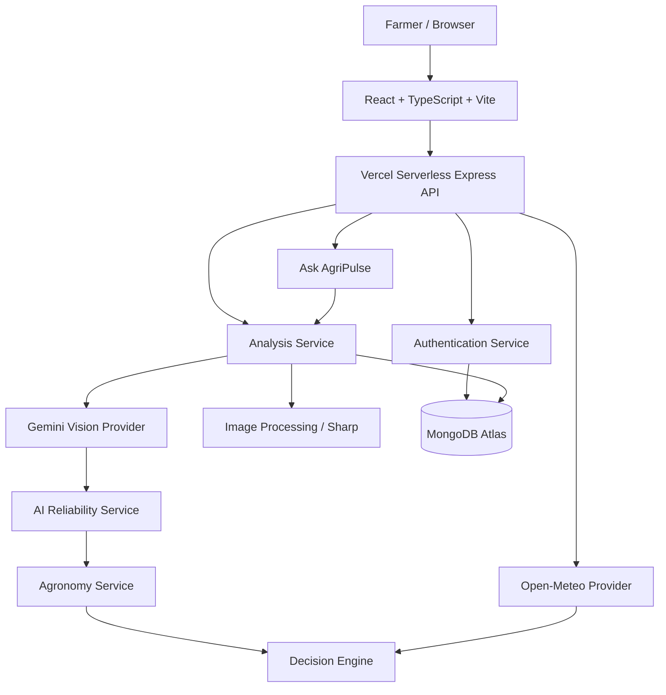

# AgriPulse 🌱

> **Weather-Aware Agricultural Decision Support powered by Crop Vision AI**

AgriPulse is a production-oriented agricultural decision-support platform that combines crop-image analysis, agronomic knowledge, micro-weather forecasting, and a deterministic weather-window engine to help farmers make safer field-management decisions.

**Live Demo:** https://agripulse-project.vercel.app/  
**GitHub:** https://github.com/viharikalla/AgriPulse

---

## 1. Problem

Farmers often have to make crop-management decisions using incomplete information:

- A crop symptom may be difficult to identify from a photograph.
- Weather can make an otherwise reasonable spray decision unsafe or ineffective.
- Generic AI answers can confidently suggest a disease or treatment without sufficient evidence.
- Historical field analyses are difficult to organize and revisit.
- Smallholder farmers need actionable guidance rather than raw model output.

AgriPulse addresses this by separating **visual diagnosis**, **agronomic grounding**, and **weather-based action timing** instead of treating a general-purpose AI response as the final recommendation.

---

## 2. Solution

AgriPulse follows this pipeline:

```text
Farmer
  │
  ├── Select Crop
  ├── Provide Location
  └── Upload Crop Image
          │
          ▼
     Image Processing
          │
          ▼
     Gemini Vision AI
          │
          ▼
   Structured Assessment
          │
          ▼
   Reliability Verification
      │       │       │
      │       │       └── UNSUPPORTED
      │       └────────── NEEDS_REVIEW
      └────────────────── RELIABLE
          │
          ▼
   Agronomy Knowledge Base
          │
          ▼
   Open-Meteo Forecast
          │
          ▼
 Deterministic Decision Engine
          │
          ▼
     Farmer Advisory
          │
          ▼
 MongoDB Atlas + History
```

The key safety principle is:

> **AI visual evidence does not directly determine chemical treatment.**

A diagnosis must first be sufficiently reliable and grounded in the AgriPulse crop/condition taxonomy.

---

## 3. Core Features

### 🌿 Multi-Crop Vision Analysis

AgriPulse supports a 10-crop taxonomy:

- Rice
- Wheat
- Maize
- Tomato
- Potato
- Chilli
- Soybean
- Groundnut
- Chickpea
- Cotton

The vision pipeline produces structured assessment information such as:

- observed symptoms
- candidate condition
- confidence
- severity
- visual evidence
- reliability status

### 🌦️ Weather-Aware Decisions

AgriPulse combines the field assessment with hourly weather information to determine whether conditions are suitable for action.

The decision engine evaluates:

- wind speed
- precipitation probability
- available dry period
- forecast timing

Decision states:

| Status | Farmer-facing label |
|---|---|
| `ACT_NOW` | Good spray window open now |
| `FAVORABLE` | Favorable weather window available |
| `WAIT` | Wait for safer weather window |
| `NO_SUITABLE_WINDOW` | No suitable window in forecast |
| `INSUFFICIENT_DATA` | Field verification needed |

### 🛡️ AI Reliability Safety Layer

AgriPulse does not blindly trust a vision model.

A result can be:

- **RELIABLE** — sufficiently confident and grounded.
- **NEEDS_REVIEW** — visual evidence is insufficient.
- **UNSUPPORTED** — condition cannot be grounded in the current AgriPulse taxonomy.

For uncertain or unsupported diagnoses, the application:

- asks for field verification;
- avoids disease-specific chemical recommendations;
- avoids chemical dosage recommendations;
- avoids inventing an alternative disease;
- provides non-chemical inspection and monitoring guidance.

### 👨‍🌾 Farmer Authentication

AgriPulse includes:

- signup
- login
- logout
- current-user session
- password confirmation
- password visibility toggles
- server-side validation
- bcrypt password hashing
- HttpOnly session cookies
- rate limiting
- authenticated route protection

### 📚 Analysis History

Authenticated farmers can:

- view previous field analyses;
- open individual analysis records;
- retain uploaded field images;
- revisit previous advisories;
- maintain history across sessions and Vercel serverless invocations.

Analysis records are isolated by authenticated `userId`.

### 💬 Ask AgriPulse

The advisory page includes an interactive agronomic assistant.

The assistant receives analysis context and respects the reliability state.

For `NEEDS_REVIEW` or `UNSUPPORTED` analyses, it must not:

- substitute another disease;
- invent a diagnosis;
- provide disease-specific chemical dosage;
- recommend unsupported chemical treatment.

For reliable analyses, contextual agronomic questions can receive disease-specific guidance.

### 🎨 Farmer-Friendly UI

The frontend uses a liquid-glass visual language with:

- progressive blur
- glass cards
- motion transitions
- weather visualizations
- structured advisory sections
- responsive layouts
- accessible controls
- clear reliability states

---

## 4. Safety Architecture

AgriPulse deliberately separates three concerns.

### Layer 1 — Vision

Gemini analyzes the uploaded crop image and returns structured visual evidence.

### Layer 2 — Reliability & Grounding

The application checks:

- crop compatibility;
- supported condition;
- confidence;
- AgriPulse taxonomy;
- reliability state.

### Layer 3 — Agronomic Decision

Only grounded information proceeds into the agronomy and weather decision pipeline.

This prevents a low-confidence model output from automatically becoming a chemical recommendation.

---

## 5. NEEDS_REVIEW Safety Contract

When visual evidence is insufficient:

```text
RELIABILITY STATUS
       │
       ▼
NEEDS_REVIEW
       │
       ├── Field inspection
       ├── Non-chemical sanitation
       ├── Monitoring
       └── No disease-specific chemical treatment
```

The application intentionally displays:

> **AGRONOMIC VERIFICATION NEEDED**

instead of pretending that the diagnosis is certain.

This behavior is enforced in both frontend presentation and backend agronomy services.

---

## 6. Agronomy Knowledge Base

AgriPulse contains crop-specific agronomic knowledge for the supported taxonomy.

The knowledge base includes validated condition profiles covering the supported crop-condition combinations.

The agronomy layer provides structured information used for:

- condition grounding
- symptom interpretation
- management actions
- monitoring guidance
- treatment-related decision logic where the diagnosis is reliable

The application does not invent missing condition definitions merely to force an AI result into the taxonomy.

For example, the evaluation set contained a Maize Fall Armyworm image, but that condition was excluded from the registered evaluation cases because the current AgriPulse Maize knowledge base does not support it.

---

## 7. Weather Intelligence

AgriPulse uses Open-Meteo for weather intelligence.

The weather pipeline includes:

1. Location input
2. Location/geocoding resolution
3. Current weather
4. Hourly forecast
5. Forecast-window analysis
6. Weather suitability scoring
7. Farmer-facing decision

The application considers a forecast window rather than simply displaying current weather.

### Decision Constraints

The deterministic spray-window engine uses hard constraints including:

- wind below 12 km/h
- dry window of at least 4 hours
- rain probability below 20%

These constraints are evaluated alongside forecast timing.

The UI communicates the result in farmer-friendly language instead of exposing only raw meteorological values.

---

## 8. System Architecture



---

## 9. Technology Stack

| Layer | Technology |
|---|---|
| Frontend | React |
| Language | TypeScript |
| Build Tool | Vite |
| Styling | Tailwind CSS |
| Backend | Node.js + Express |
| Database | MongoDB Atlas |
| ODM | Mongoose |
| Vision AI | Google Gemini |
| Validation | Zod |
| Image Processing | Sharp |
| Authentication | JWT + HttpOnly cookies |
| Password Hashing | bcryptjs |
| Weather | Open-Meteo |
| Testing | Vitest + Supertest |
| Deployment | Vercel |

---

## 10. Frontend Architecture

```text
src/
├── components/
│   ├── advisory/
│   ├── ai/
│   ├── auth/
│   ├── field/
│   ├── layout/
│   ├── motion/
│   ├── ui/
│   └── weather/
├── config/
├── context/
├── data/
├── hooks/
├── lib/
├── pages/
├── services/
├── test/
├── types/
├── App.tsx
├── index.css
└── main.tsx
```

### Important frontend pages

- `HomePage`
- `LoginPage`
- `SignupPage`
- `DashboardPage`
- `AnalyzePage`
- `AdvisoryDetailPage`
- `HistoryPage`
- `HistoryDetailPage`

### Authentication

`AuthContext` manages the authenticated farmer state.

`ProtectedRoute` protects:

- dashboard
- analysis
- history
- advisory detail

Session credentials are handled through cookies rather than localStorage.

---

## 11. Backend Architecture

```text
server/src/
├── config/
├── controllers/
├── data/
│   └── agronomy/
├── db/
├── middleware/
├── models/
├── providers/
│   ├── ai/
│   └── weather/
├── routes/
├── schemas/
├── services/
│   ├── agronomy/
│   ├── ai/
│   ├── analysis/
│   ├── auth/
│   ├── decision/
│   └── ...
├── types/
├── utils/
├── app.ts
└── server.ts
```

### Layering

```text
Routes
  ↓
Controllers
  ↓
Services
  ↓
Providers / Models
  ↓
External Services / MongoDB
```

`server/src/app.ts` creates and exports the Express application.

`server/src/server.ts` is used for local development.

The Vercel serverless entrypoint uses the compiled backend application.

---

## 12. AI Provider Architecture

AgriPulse uses a provider abstraction:

```text
AIProvider
├── GeminiVisionProvider
└── MockAIProvider
```

This makes the application testable without consuming Gemini API quota.

### Production

```text
AI_PROVIDER=gemini
```

### Tests / local safe mode

```text
AI_PROVIDER=mock
```

The mock provider allows the majority of automated tests to execute without real Gemini calls.

---

## 13. Gemini Vision Pipeline

The production vision flow is:

```text
Uploaded image
      ↓
Multer memory storage
      ↓
Image validation
      ↓
Sharp processing
      ↓
Gemini Vision
      ↓
Structured output
      ↓
Zod validation
      ↓
Reliability verification
      ↓
Agronomy grounding
```

Raw image buffers are not stored in MongoDB.

The current implementation persists the optimized image representation as a Data URL so the advisory and history pages can render the original uploaded field image without relying on browser-only object URLs.

---

## 14. Database Architecture

MongoDB Atlas stores authenticated users and analysis records.

### Users

Conceptually:

```text
User
├── _id
├── name
├── email
├── passwordHash
├── createdAt
└── updatedAt
```

Passwords are stored as bcrypt hashes and never returned to the frontend.

### Analyses

Conceptually:

```text
Analysis
├── _id
├── userId
├── sessionId
├── createdAt
├── location
├── latitude
├── longitude
├── crop
├── photoUrl
├── assessment
├── weatherSnapshot
├── decision
├── managementActions
├── sourceMetadata
└── notes
```

The application uses a custom string analysis ID such as:

```text
adv-<timestamp>
```

The schema explicitly supports string `_id` values.

### Indexing

Indexes support:

- session history
- analysis detail lookup
- crop-filtered history
- ownership-related queries

---

## 15. Authentication & Security

### Password requirements

Passwords require:

- minimum 8 characters
- uppercase letter
- lowercase letter
- number
- special character

Confirm password must exactly match the password.

### Session

Authentication uses:

```text
agripulse_session
```

The session is stored in an HttpOnly cookie.

Production cookies use secure transport.

### Security controls

AgriPulse includes:

- bcrypt password hashing
- HttpOnly cookies
- SameSite cookie protection
- authentication middleware
- ownership checks
- rate limiting
- CORS restrictions
- Helmet security headers
- sanitized error responses
- server-only environment secrets

Secrets are never embedded in frontend source code.

---

## 16. Analysis Ownership

Every authenticated analysis is associated with a user.

For example:

```text
User A
 ├── Analysis 1
 ├── Analysis 2
 └── Analysis 3

User B
 ├── Analysis 4
 └── Analysis 5
```

User A cannot access User B's analysis by changing the analysis ID.

Unauthorized access is handled as a safe not-found response rather than exposing another user's record.

---

## 17. History Persistence

The production history pipeline is:

```text
POST /api/analyze
       ↓
Authenticated userId
       ↓
MongoDB Analysis document
       ↓
GET /api/history
       ↓
find({ userId })
       ↓
HistoryPage
```

The history endpoint is explicitly non-cacheable because it contains personalized data.

Responses use:

```text
Cache-Control: private, no-cache, no-store, must-revalidate
Pragma: no-cache
Expires: 0
```

This prevents stale empty-history responses from being reused by the browser.

---

## 18. API Endpoints

### Authentication

```text
POST /api/auth/signup
POST /api/auth/login
POST /api/auth/logout
GET  /api/auth/me
```

### Analysis

```text
POST /api/analyze
GET  /api/analysis/:id
GET  /api/history
```

### Weather

```text
GET /api/weather
```

### Location

```text
GET /api/location/*
```

### Decision

```text
GET /api/decision/*
```

### Assistant

```text
POST /api/assistant/*
```

### Health

```text
GET /api/health
```

The exact request and response structures are implemented in the corresponding Zod schemas, controllers, services, and API client.

---

## 19. Image Handling

Images are processed in memory.

```text
Browser
  ↓
Multipart upload
  ↓
Multer memoryStorage
  ↓
Sharp
  ↓
Optimized image
  ↓
Gemini
  ↓
Persisted Data URL
```

No temporary image files are required by the production analysis pipeline.

Client and server validation prevent unsupported or oversized uploads from entering the analysis pipeline.

---

## 20. Evaluation Harness

AgriPulse includes a separate multi-crop vision evaluation harness.

```text
server/evaluation/
├── cases.json
├── schema.ts
├── source-manifest.json
└── images/
    ├── rice/
    ├── wheat/
    ├── maize/
    ├── tomato/
    ├── potato/
    ├── chilli/
    ├── soybean/
    ├── groundnut/
    ├── chickpea/
    └── cotton/
```

The harness is intentionally isolated from normal application startup and API requests.

It is explicitly invoked from the command line.

Example:

```bash
cd server
npx tsx scripts/evaluate-vision-set.ts --limit 5
```

Quota protection prevents accidental large Gemini evaluations.

---

## 21. Evaluation Dataset

The current registered evaluation batch contains grounded cases across supported crops.

The evaluation infrastructure tracks:

- crop
- expected condition
- image path
- dataset/source
- image quality
- notes
- crop agreement
- diagnostic agreement
- reliability outcome

An unsupported Maize Fall Armyworm image was retained in provenance tracking but excluded from the grounded evaluation cases because that condition is not currently supported by the AgriPulse Maize knowledge base.

Chickpea was excluded from the registered evaluation batch.

---

## 22. Testing

Testing is a major part of the project.

The current quality gate includes:

### Frontend

```text
19 / 19 tests passing
```

### Backend

```text
131 / 131 tests passing
```

### Total

```text
150 / 150 tests passing
```

Additional verification includes:

```bash
npx tsc --noEmit
npm run build

cd server
npx tsc --noEmit
npm run build
```

All reported production quality gates pass with zero TypeScript errors.

### Tested areas

The test suite covers:

- authentication
- signup validation
- login
- password rules
- password visibility UI
- protected routes
- API integration
- crop taxonomy
- agronomy knowledge
- AI reliability
- treatment leakage prevention
- analysis ownership
- MongoDB persistence
- custom string analysis IDs
- history retrieval
- history caching
- weather providers
- Open-Meteo schemas
- decision engine
- evaluation harness
- evaluation images
- security/pipeline behavior
- Gemini provider integration

---

## 23. Local Development

### Prerequisites

- Node.js
- npm
- MongoDB Atlas account for production persistence
- Gemini API key for real vision analysis

### Clone

```bash
git clone https://github.com/viharikalla/AgriPulse.git
cd AgriPulse
```

### Install frontend dependencies

```bash
npm install
```

### Install backend dependencies

```bash
cd server
npm install
cd ..
```

### Configure backend environment

Copy:

```text
server/.env.example
```

to:

```text
server/.env
```

Configure the required server-side values.

Example structure:

```env
AI_PROVIDER=gemini
GEMINI_API_KEY=your_server_side_key
GEMINI_MODEL=your_configured_model
MONGODB_URI=your_mongodb_atlas_connection_string
AUTH_SESSION_SECRET=your_long_random_secret
NODE_ENV=development
CLIENT_ORIGIN=http://localhost:5173
```

Never commit `server/.env`.

### Run frontend

```bash
npm run dev
```

### Run backend

```bash
cd server
npm run dev
```

The local backend runs on the configured development port.

---

## 24. Production Deployment

AgriPulse is deployed as a Vercel application.

### Production architecture

```text
                    Vercel
                      │
        ┌─────────────┴─────────────┐
        │                           │
   React/Vite SPA             Express API
        │                           │
     /index.html                /api/*
                                    │
                       ┌────────────┼────────────┐
                       │            │            │
                   Gemini       MongoDB      Open-Meteo
```

### Vercel files

```text
vercel.json
api/index.ts
```

`api/index.ts` acts as the serverless entrypoint for the compiled Express backend.

The frontend remains a Vite SPA.

### SPA routing

Vercel rewrites frontend routes to:

```text
/index.html
```

API requests are routed separately to the serverless function.

---

## 25. Production Environment Variables

The following values must be configured as **Vercel server-side environment variables**:

```text
GEMINI_API_KEY
MONGODB_URI
AUTH_SESSION_SECRET
AI_PROVIDER
GEMINI_MODEL
NODE_ENV
CLIENT_ORIGIN
```

Do not put these values in:

- React source code
- `src/`
- `vercel.json`
- README
- Git commits
- browser localStorage
- browser sessionStorage

The frontend does not require access to the Gemini API key or MongoDB credentials.

---

## 26. Production Security Checklist

Before deployment:

- [x] Gemini key kept server-side
- [x] MongoDB credentials kept server-side
- [x] Authentication secret kept server-side
- [x] `.env` ignored by Git
- [x] Passwords hashed
- [x] Password hashes excluded from API responses
- [x] HttpOnly authentication cookie
- [x] User ownership checks
- [x] Auth rate limiting
- [x] CORS restricted to the application origin
- [x] Security headers enabled
- [x] Personalized history marked non-cacheable
- [x] Treatment leakage regression tests
- [x] No raw API credentials in frontend

---

## 27. Farmer User Flow

A typical farmer workflow is:

```text
1. Open AgriPulse
        ↓
2. Sign up / Log in
        ↓
3. Open Analyze Field
        ↓
4. Select crop
        ↓
5. Enter field location
        ↓
6. Upload crop image
        ↓
7. Start analysis
        ↓
8. Gemini analyzes visual evidence
        ↓
9. Reliability layer verifies result
        ↓
10. Agronomy knowledge grounds the condition
        ↓
11. Weather service retrieves forecast
        ↓
12. Decision engine evaluates weather window
        ↓
13. Advisory is displayed
        ↓
14. Farmer can ask AgriPulse questions
        ↓
15. Analysis is stored in History
```

---

## 28. Advisory Structure

A completed advisory can contain:

1. **Diagnosis**
2. **Action Card**
3. **Action Timeline**
4. **Weather Snapshot**
5. **Recommendation Reason**
6. **Management Details**
7. **Monitoring Checklist**
8. **Ask AgriPulse**

For uncertain diagnoses, the interface switches to a verification-oriented experience rather than presenting a confident treatment plan.

---

## 29. Example Reliability States

### RELIABLE

```text
Diagnosis
    ↓
Grounded condition
    ↓
Agronomic management
    ↓
Weather decision
    ↓
Action window
```

### NEEDS_REVIEW

```text
Insufficient visual evidence
    ↓
Field inspection
    ↓
Non-chemical management
    ↓
Monitoring
    ↓
No disease-specific chemical treatment
```

### UNSUPPORTED

```text
Condition outside current taxonomy
    ↓
Unsupported condition notice
    ↓
Field verification
    ↓
No invented diagnosis
```

---

## 30. Why the Architecture Uses a Deterministic Decision Engine

A general-purpose language model is not used to decide whether weather conditions are suitable for spraying.

Instead:

```text
Weather Forecast
      ↓
Deterministic Constraints
      ↓
Decision Status
```

This makes critical weather-window behavior:

- predictable
- testable
- explainable
- reproducible

The AI is responsible for visual interpretation and contextual language, while hard meteorological constraints remain in application code.

---

## 31. Why AI Provider Abstraction Matters

The application separates AI integration behind an interface.

Benefits:

- production Gemini can be used without changing business logic;
- tests can use a mock provider;
- API quota is protected;
- provider-specific implementation remains isolated;
- reliability logic can be regression-tested deterministically.

---

## 32. Project Structure

```text
AgriPulse/
├── api/
│   └── index.ts
├── server/
│   ├── evaluation/
│   ├── scripts/
│   ├── src/
│   │   ├── config/
│   │   ├── controllers/
│   │   ├── data/
│   │   ├── db/
│   │   ├── middleware/
│   │   ├── models/
│   │   ├── providers/
│   │   ├── routes/
│   │   ├── schemas/
│   │   ├── services/
│   │   ├── types/
│   │   └── utils/
│   ├── tests/
│   ├── .env.example
│   ├── package.json
│   └── tsconfig.json
├── src/
│   ├── components/
│   ├── config/
│   ├── context/
│   ├── data/
│   ├── hooks/
│   ├── lib/
│   ├── pages/
│   ├── services/
│   ├── test/
│   ├── types/
│   ├── App.tsx
│   └── main.tsx
├── test-assets/
├── .gitignore
├── package.json
├── tailwind.config.js
├── tsconfig.json
├── vercel.json
└── vite.config.ts
```

---

## 33. Project Limitations

AgriPulse is a decision-support system, not a replacement for a qualified agronomist or agricultural extension officer.

Important limitations include:

### Visual diagnosis

A photograph may not contain enough information to distinguish visually similar conditions.

### Taxonomy

The application can only provide grounded disease/condition-specific guidance for conditions represented in its knowledge base.

### Field conditions

A photograph cannot fully represent:

- soil condition
- root health
- pest population
- field-wide disease spread
- microscopic pathogen evidence
- local microclimate variations

### Weather

Forecast data is not a guarantee of field conditions. Farmers should verify local wind, rainfall, and leaf wetness before application.

### Treatment

Any crop-protection product must be used according to applicable local registration, label instructions, safety requirements, and qualified local agricultural guidance.

---

## 35. Responsible AI Principles

AgriPulse follows several principles:

### Ground before recommending

A model prediction should be grounded in the application's supported agronomic knowledge.

### Uncertainty should be visible

Low confidence should produce a visible verification state instead of artificial certainty.

### Deterministic rules for hard constraints

Weather-window decisions use deterministic application logic.

### No fabricated diagnoses

Unsupported conditions are not silently mapped to a different disease.

### No unsafe treatment leakage

Uncertain diagnoses do not receive disease-specific chemical recommendations.

### Human verification remains important

The application is designed to assist agricultural decision-making, not eliminate professional field inspection.

---

## 36. Demo Walkthrough

For a hackathon demonstration:

### Step 1 — Landing Page

Show the problem and AgriPulse concept.

### Step 2 — Sign Up

Create a farmer account.

### Step 3 — Analyze Field

Select:

```text
Crop → Tomato
Location → Field location
Image → Crop leaf photograph
```

### Step 4 — AI Analysis

Show the staged analysis interface.

### Step 5 — Reliability

Demonstrate either:

```text
RELIABLE
```

or:

```text
AGRONOMIC VERIFICATION NEEDED
```

### Step 6 — Weather

Show:

- current temperature
- humidity
- rainfall probability
- wind
- forecast window

### Step 7 — Decision

Demonstrate:

```text
ACT_NOW
```

or:

```text
WAIT
```

depending on weather.

### Step 8 — Ask AgriPulse

Ask a contextual agronomic question.

### Step 9 — History

Open History and demonstrate that the analysis persists.

### Step 10 — Persistence

Refresh or log out/in and show that the record remains available.

---

## 37. Production Verification

The production application has been verified for:

- frontend build
- backend build
- frontend TypeScript
- backend TypeScript
- authentication
- MongoDB Atlas connection
- MongoDB analysis persistence
- analysis history
- history cache prevention
- uploaded image persistence
- Gemini vision integration
- reliability safety
- treatment leakage prevention
- Ask AgriPulse context handling
- user ownership isolation

Current automated test status:

```text
Frontend: 19 / 19
Backend: 131 / 131
Total:    150 / 150
```

---

## 38. Development Commands

### Frontend

```bash
npm install
npm run dev
npm run build
npx vitest run
npx tsc --noEmit
```

### Backend

```bash
cd server
npm install
npm run dev
npm run build
npx vitest run
npx tsc --noEmit
```

### Return to project root

```bash
cd ..
```

---

## 39. Git Safety

Never commit:

```text
server/.env
.env
.env.local
API keys
MongoDB connection strings containing credentials
JWT/session secrets
private certificates
```

The repository contains environment templates such as:

```text
server/.env.example
```

Use those templates as the starting point for local configuration.

---

## 40. License & Attribution

AgriPulse is an original project implementation.

Third-party services and datasets used during development/evaluation retain their respective licenses and attribution requirements.

Relevant external services include:

- Google Gemini
- MongoDB Atlas
- Open-Meteo
- Vercel

Evaluation images are tracked with source/provenance metadata inside:

```text
server/evaluation/source-manifest.json
```

---

## 41. Author

**Designed and Developed by Vihari Kalla**

AgriPulse was built as an end-to-end agricultural AI decision-support platform with an emphasis on:

- practical farmer workflows;
- responsible AI;
- weather-aware decisions;
- grounded agronomic knowledge;
- secure authentication;
- persistent analysis history;
- testable production architecture.

---

## 42. Live Project

### Application

https://agripulse-project.vercel.app/

### Source Repository

https://github.com/viharikalla/AgriPulse

---

## 43. Final Summary

AgriPulse is not simply a crop-image classifier.

It combines:

```text
Computer Vision
      +
AI Reliability
      +
Agronomic Knowledge
      +
Weather Intelligence
      +
Deterministic Decision Logic
      +
Secure Authentication
      +
Persistent Farmer History
      +
Context-Aware Agronomic Assistant
```

The result is a complete decision-support workflow designed to help farmers move from:

> **"What is happening to my crop?"**

to:

> **"How confident are we, what should I verify, and when is it safer to act?"**

That distinction is the foundation of AgriPulse's safety-oriented architecture.
