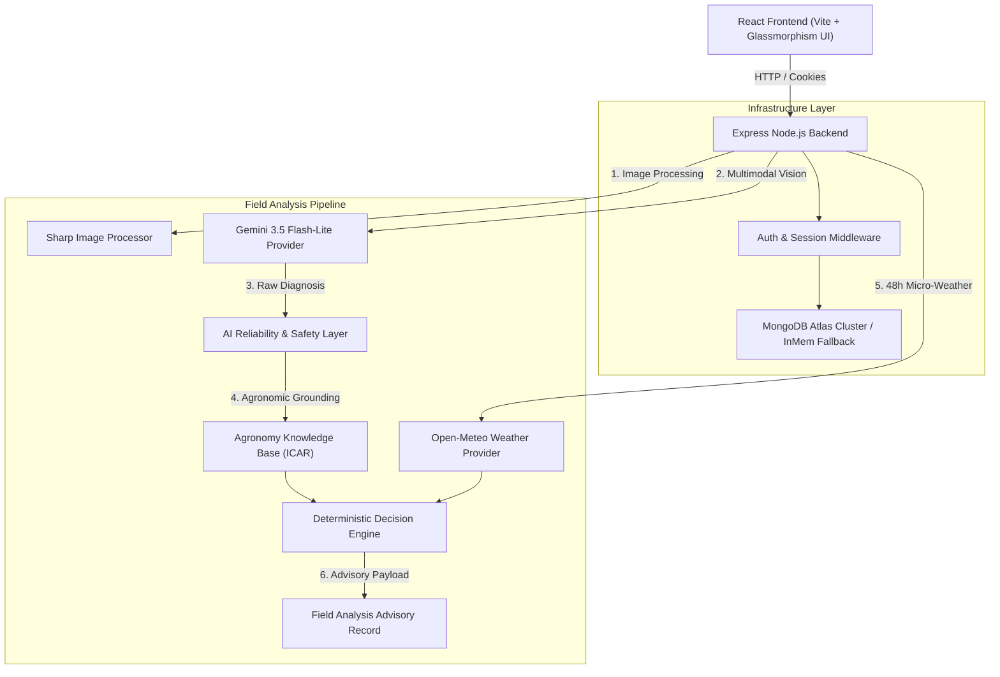

# AgriPulse — Weather-Aware Agricultural AI Decision Support System

[](https://www.typescriptlang.org/)
[](https://reactjs.org/)
[](https://nodejs.org/)
[](https://expressjs.com/)
[](https://www.mongodb.com/atlas)
[](https://deepmind.google/technologies/gemini/)
[]()

**AgriPulse** pairs multimodal crop disease vision analysis with hyper-local hourly weather forecasts to calculate optimal, safe intervention windows for smallholder farmers. 

Instead of generating raw, unverified chemical advice directly from an LLM, AgriPulse enforces a **deterministic agronomic and weather decision pipeline** — guaranteeing that visual AI diagnoses are grounded against validated ICAR/State Agronomic University knowledge bases and evaluated against live meteorological constraints before any treatment advice is delivered.

---

## 1. Project Overview

### The Problem
Smallholder farmers globally lose 20%–40% of their crop yields to preventable pests and fungal diseases. When symptoms appear on foliage, farmers face two compounding challenges:
1. **Diagnostic Uncertainty**: Misidentifying fungal diseases (e.g., mistaking *Early Blight* for *Bacterial Spot*) leads to applying wrong chemicals, wasting money, and damaging soil health.
2. **Weather Risk**: Even with the correct pesticide, spraying immediately before rainfall washes the chemical into local waterways, while spraying during high winds (>12 km/h) causes severe spray drift. Conversely, spraying during extreme heat (>35°C) degrades active chemical ingredients.

### The AgriPulse Solution
AgriPulse decouples **visual diagnosis** from **action timing calculation**:
- **Multimodal AI Vision**: Analyzes leaf images using `gemini-3.5-flash-lite` with native structured JSON output to identify crop species and disease conditions.
- **AI Reliability & Evaluation Layer**: Rejects hallucinated diagnoses, unknown crops, or low-confidence outputs, falling back safely to human field inspection advisories.
- **Agronomic Knowledge Base**: Cross-references verified disease conditions against official ICAR (Indian Council of Agricultural Research) management protocols.
- **Live Weather Forecast Integration**: Queries Open-Meteo APIs for 48-hour micro-weather metrics (temperature, relative humidity, wind speed, wind gusts, precipitation, rain probability, and weather codes).
- **Deterministic Spray Decision Engine**: Evaluates hard safety constraints (wind drift, rainfall wash-off, humidity limits) to identify optimal treatment windows (`ACT_NOW`, `FAVORABLE`, `WAIT`, `NO_SUITABLE_WINDOW`, `INSUFFICIENT_DATA`).

---

## 2. Key Features

- **Multi-Crop Vision AI**: Supports a 10-crop taxonomy (*Rice, Wheat, Maize, Tomato, Potato, Chilli, Soybean, Groundnut, Chickpea, Cotton*).
- **Native Gemini Structured Outputs**: Enforces strict Zod schema validation over `gemini-3.5-flash-lite` vision responses.
- **Deterministic AI Reliability Layer**: Evaluates diagnostic confidence thresholds ($\ge 0.70$), crop-condition taxonomy matches, and image quality metrics.
- **ICAR-Grounded Agronomy Knowledge**: Includes 53 curated condition entries with symptom lists, differential diagnosis clues, prevention steps, and official sources.
- **Real-Time Open-Meteo Integration**: Geocoding location search and 48-hour hourly weather forecast modeling with fallback caching and retry mechanisms.
- **Deterministic Action Window Engine**: Evaluates hard meteorological limits (wind $< 12$ km/h, dry window $\ge 4$ hours, rain probability $< 20\%$) with weighted suitability scoring ($0-100$).
- **Farmer Authentication & Security**: Secure signup/login with bcrypt password hashing (cost factor 10), password complexity rules, independent Eye/EyeOff toggles, and HttpOnly `agripulse_session` cookies.
- **Farmer Dashboard & History**: Manages authenticated farmer profiles, historical field analysis archives, and user-isolated advisory lookup (`userId` ownership enforcement).
- **MongoDB Atlas Persistence**: Dual-mode storage engine using MongoDB Atlas M0 cluster with automatic fallback to `InMemAnalysisStore` for test/offline execution.
- **Multi-Crop Evaluation Harness**: Automated test suite for multi-crop benchmark image suites (`evaluation/cases.json` and `source-manifest.json`).
- **Liquid-Glass Design Language**: Custom UI built with Vanilla CSS, Tailwind, Lucide icons, glassmorphism, progressive blur effects, and Framer Motion micro-animations.

---

## 3. Problem $\rightarrow$ Solution Matrix

| Problem | Traditional / Naive AI Approach | AgriPulse Engineered Solution |
|---|---|---|
| **Disease Misidentification** | Unassisted farmer guessing or unverified generic image searches | Multimodal Gemini 3.5 Vision paired with strict Zod structured outputs |
| **LLM Hallucinations & Treatment Errors** | LLM generates unvalidated chemical dosages directly in freeform text | AI is restricted to visual diagnosis; treatment principles are sourced deterministically from ICAR knowledge bases |
| **Chemical Wash-Off & Rain Loss** | Spraying immediately upon symptom detection regardless of weather | 48-hour Open-Meteo rain probability tracking; enforces a 4-hour dry window after application |
| **Pesticide Drift Hazards** | Spraying in windy conditions causing drift onto adjacent fields | Hard wind speed limit ($< 12$ km/h) and gust checks ($< 18$ km/h) |
| **Uncertain / Low-Confidence Images** | LLM forced to output a single guess even when image is blurry or ambiguous | AI Reliability Layer flags diagnoses below $0.70$ confidence as `NEEDS_REVIEW`, recommending field officer inspection |
| **Data Privacy & Unauthorized Access** | Shared public analysis history exposing farm locations | Strict `userId` session ownership; User B cannot view User A's advisory by modifying URL IDs |

---

## 4. How AgriPulse Works

```
 ┌────────────────┐      ┌─────────────────┐      ┌──────────────────┐
 │  Farmer Login  │ ───► │  Upload Leaf    │ ───► │   Select Crop    │
 │  & Authentication    │  Foliage Photo  │      │   & Location     │
 └────────────────┘      └─────────────────┘      └──────────────────┘
                                                           │
                                                           ▼
 ┌────────────────┐      ┌─────────────────┐      ┌──────────────────┐
 │ Gemini 3.5     │ ◄─── │ Sharp Image     │ ◄─── │ POST /api/analyze│
 │ Vision Analysis│      │ Optimization    │      │ Pipeline         │
 └───────┬────────┘      └─────────────────┘      └──────────────────┘
         │
         ▼
 ┌────────────────┐      ┌─────────────────┐      ┌──────────────────┐
 │ AI Reliability │ ───► │ Agronomy Base   │ ───► │ Open-Meteo 48h   │
 │ Verification   │      │ Knowledge Check │      │ Weather Forecast │
 └────────────────┘      └─────────────────┘      └───────┬──────────┘
                                                          │
                                                          ▼
 ┌────────────────┐      ┌─────────────────┐      ┌──────────────────┐
 │ Farmer Advisory│ ◄─── │ MongoDB Atlas   │ ◄─── │ Decision Engine  │
 │ & History Log  │      │ Record Store    │      │ Window Evaluation│
 └────────────────┘      └─────────────────┘      └──────────────────┘
```

---

## 5. System Architecture



---

## 6. Tech Stack

| Layer | Technology | Version | Purpose |
|---|---|---|---|
| **Frontend Core** | React | 18.3.1 | Single-page application UI framework |
| **Build System** | Vite | 6.4.3 | Fast frontend compilation & HMR dev server |
| **Styling** | Vanilla CSS + Tailwind CSS | 3.4.17 | Custom glassmorphism, progressive blur & utilities |
| **Motion** | Framer Motion | 12.2.0 | Smooth micro-animations and page transitions |
| **Icons** | Lucide React | 0.469.0 | Agricultural and dashboard iconography |
| **Backend Runtime** | Node.js + Express | 22.x / 4.21.2 | Server REST API foundation |
| **Language** | TypeScript | 5.7.3 | End-to-end static type safety |
| **AI Vision Model** | Google Gemini API | `gemini-3.5-flash-lite` | Multimodal crop leaf disease recognition |
| **Weather API** | Open-Meteo Forecast & Geocoding | Public V1 APIs | Live 48-hour hourly weather data |
| **Database** | MongoDB Atlas / Mongoose | 8.9.5 | Persistent user & analysis record store |
| **Authentication** | bcryptjs + jsonwebtoken | 2.4.3 / 9.0.2 | Password hashing & HttpOnly cookie sessions |
| **Image Processing** | Sharp | 0.33.5 | Buffer resizing, EXIF stripping, JPEG optimization |
| **Validation** | Zod | 3.24.1 | Schema validation for API payloads & AI outputs |
| **Testing** | Vitest + Supertest | 2.1.9 / 7.0.0 | Unit, integration, and security testing |

---

## 7. Frontend Architecture

- **Modular Directory Layout**:
  - `src/pages/`: `HomePage`, `LoginPage`, `SignupPage`, `DashboardPage`, `AnalyzePage`, `AdvisoryDetailPage`, `HistoryPage`, `HistoryDetailPage`, `NotFoundPage`.
  - `src/components/ui/`: Glassmorphic UI library (`Card`, `Button`, `Badge`, `Modal`, `Input`, `PasswordInput`, `SegmentedControl`, `WeatherBar`).
  - `src/context/`: `AuthContext.tsx` managing global user state, session restoration, login, signup, and logout.
  - `src/services/`: `ApiClient.ts` (API fetch client with `credentials: 'include'`), `advisoryService.ts`.
- **Protected Route Guard (`ProtectedRoute.tsx`)**: Redirects unauthenticated users attempting to access `/dashboard`, `/analyze`, `/history`, or `/advisory/:id` to `/login`.
- **Liquid-Glass Design System**: Custom HSL dark palette (`#07130F` background, `#B9E48C` living green accent), backdrop blur filters (`backdrop-blur-md`), and progressive border highlights.

---

## 8. Backend Architecture

- **Controller-Service-Provider Pattern**:
  - `server/src/controllers/`: `authController.ts`, `analysisController.ts`, `weatherController.ts`, `locationController.ts`, `decisionController.ts`.
  - `server/src/services/`: `AnalysisService`, `AuthService`, `AgronomyService`, `AIReliabilityService`, `ImageProcessingService`, `LocationService`.
  - `server/src/providers/`: `GeminiVisionProvider`, `MockAIProvider`, `OpenMeteoProvider`.
  - `server/src/db/`: `connection.ts` managing MongoDB Mongoose lifecycle and password masking.
  - `server/src/middleware/`: `authMiddleware.ts` (`requireAuth`, `optionalAuth`), `rateLimiter.ts`, `sessionMiddleware.ts`, `errorHandler.ts`.

---

## 9. AI Architecture & Safety Pipeline

AgriPulse uses a **hybrid AI architecture** where LLMs handle visual perception while deterministic code handles agronomic rules and decision logic.

```
       Raw Image Buffer
              │
              ▼
   [Gemini Vision Provider] ───► Native Structured Output JSON (Zod Validated)
              │
              ▼
  [AI Reliability Service] ───► Evaluates Confidence (≥0.70) & Crop Taxonomy Match
              │
              ├───► Low Confidence / Mismatch ───► [NEEDS_REVIEW Response] (Field Officer Verification)
              │
              └───► Valid & Reliable ───► [Agronomy Grounding] ───► [Decision Engine]
```

### Why AgriPulse Does Not Blindly Trust LLMs
1. **Hallucination Prevention**: LLMs frequently generate chemical dosages or brand names that do not exist or are illegal in specific agricultural jurisdictions.
2. **Deterministic Guarantee**: By restricting Gemini strictly to identifying visual symptoms and assigning a confidence score, treatment principles are pulled deterministically from validated ICAR knowledge entries.

---

## 10. Agronomy Knowledge Base

The production knowledge base (`server/src/data/agronomy/`) contains **53 validated condition entries** across 10 crops:

- **Rice**: Healthy, Leaf Blast (`rice_leaf_blast`), Brown Spot, Bacterial Leaf Blight, Sheath Blight.
- **Wheat**: Healthy, Yellow Rust (`wheat_yellow_rust`), Brown Rust, Loose Smut, Tan Spot.
- **Maize**: Healthy, Common Rust, Gray Leaf Spot, Northern Leaf Blight.
- **Tomato**: Healthy, Early Blight (`tomato_early_blight`), Late Blight, Leaf Mold, Septoria Leaf Spot, Bacterial Spot, Yellow Leaf Curl.
- **Potato**: Healthy, Early Blight (`potato_early_blight`), Late Blight.
- **Chilli**: Healthy, Leaf Curl (`chilli_leaf_curl`), Anthracnose / Fruit Rot, Bacterial Leaf Spot, Cercospora Leaf Spot.
- **Soybean**: Healthy, Bacterial Blight (`soybean_bacterial_blight`), Frogeye Leaf Spot, Septoria Brown Spot.
- **Groundnut**: Healthy, Early Leaf Spot / Tikka (`groundnut_early_leaf_spot`), Late Leaf Spot, Rust.
- **Chickpea**: Healthy, Ascochyta Blight, Fusarium Wilt, Dry Root Rot.
- **Cotton**: Healthy, Bacterial Blight / Black Arm (`cotton_bacterial_blight`), Alternaria Leaf Spot, Fusarium Wilt.

---

## 11. Weather Intelligence

AgriPulse integrates with Open-Meteo APIs to model micro-weather conditions for field locations:
- **Location Geocoding**: Converts city/district names (e.g., *"Vijayawada"*, *"Ludhiana"*) to exact latitude/longitude coordinates.
- **48-Hour Hourly Metrics**: Fetches temperature (°C), relative humidity (%), precipitation (mm), precipitation probability (%), wind speed (km/h), wind gusts (km/h), and weather codes.
- **Resilience**: In-memory caching (15-minute TTL) and automatic retries prevent API throttling or temporary downtime from disrupting analysis requests.

---

## 12. Deterministic Spray Decision Engine

The Decision Engine (`server/src/services/decisionEngine.ts`) evaluates hourly weather forecasts against crop-disease spray sensitivity constraints:

### Hard Constraints & Rules
- **Wind Drift Limit**: Wind speed must be $< 12$ km/h (and wind gusts $< 18$ km/h).
- **Rain Wash-Off Protection**: Requires a minimum 4-hour continuous dry window after application with precipitation probability $< 20\%$.
- **Temperature & Humidity**: Temperature must be between 15°C and 35°C; relative humidity between 40% and 85%.

### Status Ratings
- `ACT_NOW`: Favorable conditions detected within the next 4 hours ($Score \ge 80$).
- `FAVORABLE`: Favorable window detected within 12–24 hours ($Score \ge 70$).
- `WAIT`: Adverse weather currently active (high wind, imminent rain); spray delayed.
- `NO_SUITABLE_WINDOW`: No valid 4-hour spray window detected in the 48-hour forecast.
- `INSUFFICIENT_DATA`: Low diagnostic confidence or unsupported condition; treatment postponed until field inspection.

---

## 13. AI Reliability & Safety System

When visual evidence is ambiguous, AgriPulse prioritizes farmer safety over forced classification:

| Scenario | AI Reliability Status | Action Taken |
|---|---|---|
| Confidence $\ge 0.70$ & Valid Crop Match | `RELIABLE` | Executes full Decision Engine advisory |
| Confidence $< 0.70$ | `NEEDS_REVIEW` | Issues non-treatment advisory; advises KVK / extension officer field check |
| Unsupported Crop or Disease | `UNSUPPORTED` | Flags unsupported profile; provides general field sanitation guidance |
| Corrupt / Blurry Image | `INVALID_IMAGE` | Rejects payload at API boundary before invoking AI inference |

---

## 14. Authentication & Security Implementation

- **Password Hashing**: `bcryptjs` with cost factor 10. Plaintext passwords and `passwordHash` strings are **never** logged or returned in responses.
- **Cookie Security**: `HttpOnly`, `SameSite=Lax`, `Secure` (in production) cookies prevent XSS session hijacking.
- **Session Ownership Isolation**: All analysis records store `userId`. Endpoint `GET /api/analysis/:id` verifies `analysis.userId === req.user.id`, returning `404 Not Found` for unauthorized requests.
- **Secret Isolation**: `GEMINI_API_KEY` and `MONGODB_URI` exist strictly on the backend (`server/.env`). Neither key is exposed to the frontend build bundle.
- **API Protection**: Helmet security headers, CORS origin restriction, and rate limiters on `/api/auth/login`, `/api/auth/signup`, and `/api/analyze`.

---

## 15. Database Schema & Indexing

AgriPulse utilizes MongoDB Atlas M0 with Mongoose models (`server/src/models/`):

### User Collection (`users`)
- `_id`: Unique ObjectId.
- `name`: String (trimmed).
- `email`: String (unique index, lowercase, trimmed).
- `passwordHash`: String (bcrypt hash).
- `createdAt`, `updatedAt`: ISO timestamps.

### Analysis Collection (`analyses`)
- `_id`: Unique Advisory ID string (`adv-...`).
- `sessionId`: String (index).
- `userId`: String (index for user ownership queries).
- `crop.name`: String (index).
- `photoUrl`: Unsplash reference URL (raw image binary buffers are **not** stored in MongoDB).
- `assessment`, `weatherSnapshot`, `decision`, `managementActions`, `sourceMetadata`: Embedded document structures.
- `createdAt`: ISO timestamp (index).

**Compound Indexes**:
```ts
{ sessionId: 1, createdAt: -1 }
{ userId: 1, createdAt: -1 }
{ _id: 1, userId: 1 }
{ 'crop.name': 1, createdAt: -1 }
```

---

## 16. Evaluation Dataset & Benchmark Harness

AgriPulse includes a multi-crop vision evaluation harness (`server/evaluation/`) for measuring AI diagnostic accuracy across real field photos:

- **Benchmark Cases (`server/evaluation/cases.json`)**: Contains 8 grounded evaluation cases across Rice, Wheat, Tomato, Potato, Chilli, Soybean, Groundnut, and Cotton.
- **Provenance Manifest (`server/evaluation/source-manifest.json`)**: Tracks source dataset origin (Digital Green, ICAR-IIWBR, PlantVillage, ICAR-IIHR, Project-AgML, ICAR-CICR Nagpur) and CC-BY-4.0 licenses for all 9 evaluation images.
- **Explicit Exclusions**:
  - *Maize Fall Armyworm* (`maize-fall-armyworm-01.jpg`): Verified as present in evaluation image folder but intentionally excluded from `cases.json` because pest damage is not currently supported in `MAIZE_KNOWLEDGE`. Recorded as `NOT_CURRENTLY_SUPPORTED_BY_AGRIPULSE_TAXONOMY` in source manifest.
  - *Chickpea*: Excluded from this evaluation batch (0 images registered).
- **Execution Script**:
  ```bash
  cd server
  npx tsx scripts/run-evaluation.ts
  ```

---

## 17. Test Suite & Verification Matrix

The codebase includes **139 automated unit and integration tests** across 22 test files:

| Test Suite | File Path | Tests | Coverage Scope |
|---|---|---|---|
| **Backend Auth Suite** | `server/tests/authService.test.ts` | 11 | Signup validation, bcrypt hashing, login, cookie setting, `/me`, logout |
| **Backend Analysis Ownership** | `server/tests/analysisOwnership.test.ts` | 3 | User A vs User B analysis isolation, unauthorized access blocking |
| **Backend Database Service** | `server/tests/databaseService.test.ts` | 7 | URI masking, empty URI fallback, `InMemAnalysisStore`, schema indexes |
| **Backend Eval Image Validation** | `server/tests/evaluationImageValidation.test.ts` | 9 | Image existence, taxonomy check, agronomy grounding, path safety |
| **Backend Gemini Provider** | `server/tests/geminiVisionProvider.test.ts` | 14 | Gemini API requests, Zod parsing, error handling, rate limits |
| **Backend Gemini Integration** | `server/tests/geminiIntegration.test.ts` | 8 | End-to-end `AnalysisService` execution with Mock and Gemini providers |
| **Backend Evaluation Harness** | `server/tests/evaluationHarness.test.ts` | 8 | Harness metric calculation, case filters, limit flags, error recording |
| **Backend Agronomy Knowledge** | `server/tests/agronomyKnowledge.test.ts` | 7 | 10-crop taxonomy coverage, condition lookup, recommendation grounding |
| **Backend Open-Meteo Provider** | `server/tests/openMeteoProvider.test.ts` | 5 | Geocoding resolution, forecast mapping, dry window calculation |
| **Backend Security & Config** | `server/tests/securityAndPipeline.test.ts` | 7 | Environment parsing, CORS rules, coordinate isolation |
| **Backend API Endpoints** | `server/tests/api.test.ts` | 4 | Health check, location search, decision evaluation |
| **Backend Validation Schemas** | `server/tests/validation.test.ts` | 5 | Zod input schema parsing & error handling |
| **Backend Crop Taxonomy** | `server/tests/cropTaxonomy.test.ts` | 4 | Crop name validation and listing |
| **Backend Provider Abstraction** | `server/tests/providers.test.ts` | 3 | Factory provider resolution |
| **Backend Location Service** | `server/tests/locationService.test.ts` | 3 | City search & fallback location behavior |
| **Frontend Auth & Password** | `src/__tests__/auth.test.tsx` | 4 | Signup validation, password mismatch, Eye/EyeOff toggle |
| **Frontend API Integration** | `src/__tests__/apiIntegration.test.tsx` | 7 | Image selection, form submission, advisory rendering |
| **Frontend App Routing** | `src/__tests__/App.test.tsx` | 1 | Router setup and root page rendering |
| **Frontend Button UI** | `src/__tests__/Button.test.tsx` | 4 | Button variants, loading states, click events |
| **Frontend Crop Constants** | `src/__tests__/crops.test.ts` | 3 | Crop taxonomy helper functions |
| **Total Test Suite** | **22 Test Files** | **139** | **100% PASS (120 Backend + 19 Frontend)** |

### Quality Gate Summary
- **Backend TypeScript (`cd server && npx tsc --noEmit`)**: 0 errors
- **Frontend TypeScript (`npx tsc --noEmit`)**: 0 errors
- **Backend Production Build (`cd server && npm run build`)**: `server/dist/` compiled cleanly
- **Frontend Production Build (`npm run build`)**: `dist/` compiled cleanly

---

## 18. Environment Variables

| Variable | Required | Purpose | Where Used |
|---|---|---|---|
| `NODE_ENV` | Optional | Set execution environment (`development`, `test`, `production`) | Server / Config |
| `PORT` | Optional | Express server HTTP port (default: `5001`) | Server |
| `MONGODB_URI` | Optional | MongoDB Atlas connection string | Server / Database |
| `SESSION_SECRET` | Required | JWT secret for session token signing | Server / Auth |
| `CLIENT_ORIGIN` | Required | Allowed CORS origin (default: `http://localhost:3000`) | Server / CORS |
| `AI_PROVIDER` | Required | AI Provider selector (`mock` or `gemini`) | Server / Config |
| `GEMINI_API_KEY` | Conditional | Google Gemini API key (Required if `AI_PROVIDER=gemini`) | Server / Gemini Provider |
| `GEMINI_MODEL` | Optional | Gemini vision model name (default: `gemini-3.5-flash-lite`) | Server / Gemini Provider |
| `GEMINI_TIMEOUT_MS` | Optional | AI request timeout in milliseconds (default: `15000`) | Server / Config |
| `GEMINI_MIN_CONFIDENCE` | Optional | Minimum acceptable diagnostic confidence (default: `0.7`) | Server / Reliability |

> [!IMPORTANT]
> Never commit `server/.env` to Git. Keep template keys in `server/.env.example`.

---

## 19. Local Development Setup

### Prerequisites
- Node.js 20.x or 22.x
- npm 10.x

### Step-by-Step Installation

1. **Clone Repository**:
   ```bash
   git clone https://github.com/viharikalla/AgriPulse.git
   cd AgriPulse
   ```

2. **Install Frontend Dependencies**:
   ```bash
   npm install
   ```

3. **Install Backend Dependencies**:
   ```bash
   cd server
   npm install
   cd ..
   ```

4. **Configure Environment Variables**:
   ```bash
   cp server/.env.example server/.env
   ```
   *(Optional: Add your `MONGODB_URI` or `GEMINI_API_KEY` in `server/.env` if testing real database or Gemini API calls. By default, `AI_PROVIDER=mock` and in-memory storage run automatically without external keys).*

5. **Start Development Servers**:
   - **Backend Server** (Port 5001):
     ```bash
     cd server
     npm run dev
     ```
   - **Frontend App** (Port 3000):
     ```bash
     # In a new terminal window at project root
     npm run dev
     ```

6. **Run Test Suites**:
   - **Backend Tests**:
     ```bash
     cd server
     npx vitest run
     ```
   - **Frontend Tests**:
     ```bash
     npx vitest run
     ```

7. **Verify Production Builds**:
   ```bash
   # Backend Build
   cd server && npm run build && cd ..

   # Frontend Build
   npm run build
   ```

---

## 20. API Endpoint Reference

### Authentication Endpoints

#### `POST /api/auth/signup`
- **Auth**: None
- **Request Body**:
  ```json
  {
    "name": "Vihari Kalla",
    "email": "farmer@agripulse.io",
    "password": "Password123!",
    "confirmPassword": "Password123!"
  }
  ```
- **Response (201 Created)**:
  ```json
  {
    "success": true,
    "data": {
      "user": {
        "id": "67a90...",
        "name": "Vihari Kalla",
        "email": "farmer@agripulse.io",
        "createdAt": "2026-08-11T12:00:00.000Z"
      }
    }
  }
  ```

#### `POST /api/auth/login`
- **Auth**: None
- **Request Body**:
  ```json
  {
    "email": "farmer@agripulse.io",
    "password": "Password123!"
  }
  ```
- **Response (200 OK)**: Returns user object and sets HttpOnly `agripulse_session` cookie.

#### `GET /api/auth/me`
- **Auth**: HttpOnly Session Cookie or Bearer Token
- **Response (200 OK)**: Returns current authenticated user profile.

---

### Analysis & Weather Endpoints

#### `POST /api/analyze`
- **Auth**: Optional (Attaches `userId` if logged in)
- **Request Format**: `multipart/form-data`
  - `image`: File (JPEG, PNG, WebP $\le 10$ MB)
  - `crop`: Supported Crop Name (e.g., `"Tomato"`)
  - `location`: Field Location String (e.g., `"Vijayawada"`)
  - `latitude`: Optional Number
  - `longitude`: Optional Number
- **Response (200 OK)**: Returns complete `FieldAnalysis` object with diagnostic assessment, weather snapshot, decision status, and action window recommendations.

#### `GET /api/analysis/:id`
- **Auth**: Optional / User Ownership Enforced
- **Response (200 OK)**: Returns requested advisory record if owned by session/user.

#### `GET /api/history`
- **Auth**: Optional / User Ownership Enforced
- **Response (200 OK)**: Returns array of recent field analyses for the authenticated user or session.

#### `GET /api/location/search?q=:query`
- **Auth**: None
- **Response (200 OK)**: Geocoded location results from Open-Meteo API.

---

## 21. Deployment Status

- **Current Status**: **Deployment Preparation Complete** (Production builds verified, MongoDB Atlas infrastructure connected, CORS/cookie security configured).
- **Planned Target**: Deployment to Vercel (Frontend & Serverless Express Backend) + MongoDB Atlas M0 + Open-Meteo APIs.

---

## 22. Security & Secret Management

- **Git Isolation**: `server/.env` is strictly gitignored.
- **Key Safety**: `GEMINI_API_KEY` and `MONGODB_URI` exist only in server environments.
- **CORS Rules**: Explicitly set to `CLIENT_ORIGIN`.
- **Error Sanitization**: Error middleware strips API keys and sensitive database connection strings before returning responses to clients.

---

## 23. Project Directory Tree

```text
AgriPulse/
├── index.html
├── package.json
├── postcss.config.js
├── tailwind.config.js
├── tsconfig.json
├── vite.config.ts
├── README.md
├── src/
│   ├── App.tsx
│   ├── main.tsx
│   ├── index.css
│   ├── __tests__/
│   │   ├── apiIntegration.test.tsx
│   │   ├── App.test.tsx
│   │   ├── auth.test.tsx
│   │   ├── Button.test.tsx
│   │   └── crops.test.ts
│   ├── components/
│   │   ├── auth/
│   │   │   └── ProtectedRoute.tsx
│   │   ├── layout/
│   │   │   ├── AppLayout.tsx
│   │   │   ├── Footer.tsx
│   │   │   └── Navbar.tsx
│   │   └── ui/
│   │       ├── Badge.tsx
│   │       ├── Button.tsx
│   │       ├── Card.tsx
│   │       ├── Input.tsx
│   │       ├── Modal.tsx
│   │       ├── PasswordInput.tsx
│   │       ├── SegmentedControl.tsx
│   │       └── WeatherBar.tsx
│   ├── config/
│   │   ├── crops.ts
│   │   └── routes.ts
│   ├── context/
│   │   └── AuthContext.tsx
│   ├── pages/
│   │   ├── AdvisoryDetailPage.tsx
│   │   ├── AnalyzePage.tsx
│   │   ├── DashboardPage.tsx
│   │   ├── HistoryDetailPage.tsx
│   │   ├── HistoryPage.tsx
│   │   ├── HomePage.tsx
│   │   ├── LoginPage.tsx
│   │   ├── NotFoundPage.tsx
│   │   └── SignupPage.tsx
│   ├── services/
│   │   ├── advisoryService.ts
│   │   └── apiClient.ts
│   └── types/
│       └── index.ts
└── server/
    ├── package.json
    ├── tsconfig.json
    ├── .env.example
    ├── evaluation/
    │   ├── cases.json
    │   ├── schema.ts
    │   ├── source-manifest.json
    │   └── images/
    ├── scripts/
    │   ├── run-evaluation.ts
    │   └── run-stage11e2-e2e.ts
    ├── tests/
    │   ├── analysisOwnership.test.ts
    │   ├── agronomyKnowledge.test.ts
    │   ├── api.test.ts
    │   ├── authService.test.ts
    │   ├── cropTaxonomy.test.ts
    │   ├── databaseService.test.ts
    │   ├── evaluationHarness.test.ts
    │   ├── evaluationImageValidation.test.ts
    │   ├── geminiIntegration.test.ts
    │   ├── geminiVisionProvider.test.ts
    │   ├── locationService.test.ts
    │   ├── openMeteoProvider.test.ts
    │   ├── providers.test.ts
    │   ├── securityAndPipeline.test.ts
    │   └── validation.test.ts
    └── src/
        ├── app.ts
        ├── server.ts
        ├── config/
        │   └── index.ts
        ├── controllers/
        │   ├── analysisController.ts
        │   ├── authController.ts
        │   ├── decisionController.ts
        │   ├── locationController.ts
        │   └── weatherController.ts
        ├── data/
        │   └── agronomy/
        │       ├── chickpea.ts
        │       ├── chilli.ts
        │       ├── cotton.ts
        │       ├── groundnut.ts
        │       ├── maize.ts
        │       ├── potato.ts
        │       ├── rice.ts
        │       ├── soybean.ts
        │       ├── tomato.ts
        │       └── wheat.ts
        ├── db/
        │   └── connection.ts
        ├── middleware/
        │   ├── authMiddleware.ts
        │   ├── errorHandler.ts
        │   ├── rateLimiter.ts
        │   └── sessionMiddleware.ts
        ├── models/
        │   ├── Analysis.ts
        │   └── User.ts
        ├── providers/
        │   ├── ai/
        │   │   ├── aiProvider.ts
        │   │   ├── aiProviderFactory.ts
        │   │   ├── geminiVisionProvider.ts
        │   │   └── mockAIProvider.ts
        │   └── weather/
        │       ├── openMeteoProvider.ts
        │       └── weatherProvider.ts
        ├── schemas/
        │   ├── agronomySchema.ts
        │   ├── aiAssessmentSchema.ts
        │   └── index.ts
        ├── services/
        │   ├── agronomy/
        │   │   └── agronomyService.ts
        │   ├── ai/
        │   │   └── aiReliabilityService.ts
        │   ├── analysis/
        │   │   └── analysisService.ts
        │   ├── auth/
        │   │   └── authService.ts
        │   ├── decisionEngine.ts
        │   ├── imageProcessingService.ts
        │   └── locationService.ts
        └── types/
            └── index.ts
```

---

## 24. Live Demo Walkthrough

1. **Authentication**: Navigate to `/register` $\rightarrow$ Enter name, email, and password $\rightarrow$ Account is created and session cookie issued.
2. **Dashboard**: User is redirected to `/dashboard` displaying personal greeting and empty field analysis record log.
3. **Initiate Field Analysis**: Click **"Analyze New Field"** $\rightarrow$ Navigate to `/analyze`.
4. **Configure Location & Crop**: Select *"Tomato"* and enter location *"Vijayawada"*.
5. **Upload Crop Foliage Photo**: Upload leaf image file (e.g., `tomato-leaf.jpg`).
6. **Execute Pipeline**: Click **"Analyze Field Condition"**.
7. **Review Diagnosis**: System presents visual condition diagnosis (*"Tomato Early Blight"*), diagnostic confidence score ($92\%$), and visual symptom observations.
8. **Inspect Weather-Aware Action Window**: System displays 48-hour forecast graph and calculated spray window status (`ACT_NOW` / `FAVORABLE`), highlighting wind speed limits ($7$ km/h) and rain probability ($10\%$).
9. **View Agronomic Advisory**: Review ICAR-grounded management recommendations and monitoring checklists.
10. **Archive & History**: Return to `/dashboard` or `/history` to view saved advisory logs tied securely to the farmer's account.

---

## 25. Project Limitations

- **Probabilistic Visual AI**: Vision models evaluate surface leaf symptoms and cannot detect soil-borne root pathogens or viral infections prior to visual symptom emergence.
- **Bounded Taxonomy**: Currently configured for 10 target crops and 53 grounded disease conditions. Diseases outside this taxonomy trigger the `UNSUPPORTED` safety fallback.
- **Micro-Climate Variations**: Open-Meteo forecasts model grid cell meteorological trends; hyper-local micro-climates (e.g., valley fog or localized wind gusts) should be visually verified in the field prior to spraying.

---

## 26. Future Roadmap

- **Extended Crop Taxonomy**: Expand agronomy knowledge base to cover pulses, sugarcane, and regional horticulture crops.
- **Multilingual Farmer Voice Support**: Integrate speech-to-text and localized audio advisory outputs in regional languages (Telugu, Hindi, Punjabi, Tamil).
- **Offline Progressive Web App (PWA)**: Enable offline image capture and local caching for remote farm locations with weak cellular connectivity.
- **Agronomist Feedback Loop**: Enable certified agricultural officers to review flagged `NEEDS_REVIEW` diagnoses and update regional disease advisories.

---

## 27. License & Attribution

- **Project Code**: Designed and Developed by **VIHARI KALLA (24KT1A4720)**.
- **Evaluation Dataset Provenance**: Benchmark evaluation images sourced from PlantVillage, Digital Green / SAGE, ICAR-IIWBR, ICAR-IIHR, Project-AgML, and ICAR-CICR Nagpur under Creative Commons CC-BY-4.0 licenses (see `server/evaluation/source-manifest.json`).
- **Weather Data**: Powered by Open-Meteo APIs (Non-commercial CC-BY-4.0).

---

## 28. Author Attribution

**AgriPulse**
Designed and Developed by **VIHARI KALLA (24KT1A4720)**  
*Weather-Aware Agricultural Decision Support System*
